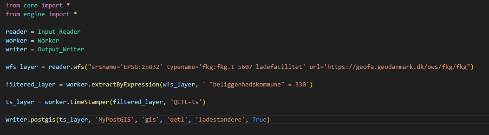

<h1 style="font-size:80px;color:black">Hvad er Q-ETL ?</h1>

---

# - Python-baseret ETL værtøj bygget på QGIS.
# - Kræver et basiskendskab til python.
# - Under løbende udvikling.

---

# Hvordan fungerer det ?

## - Scripts skrives i python, som afvikles via QGIS' motor.
## - QGIS startes uden brugerflade og afvikler ETL-jobbet.
## - Du kan med QGIS brugerfladen danne de konfigurationer til værktøjer der skal bruges i jobs.

---

## Basis eksempel

## Klassisk ETL: Læser data fra service, behandler og skriver data til en database... 
https://github.com/MFuglsang/Q-ETL/wiki/Basic-tutorial

---

# Bygget op om en række funktioner:

## - **Input Readers:** Læser data fra filer, databaser, services m.m.
## - **Workers**: laver analyser på data - geometri og atributter.
## - **Integrations**: Udveksling med andet end QGIS - for eksempel Pandas
## - **Output Writers** : Skriver data til alle OGR kompatible kilder.

---

# Projekt-status

## - En del værktøjer til vector mappet ind. Flere kommer til løbende.
## - Vi arbejder på understøttelse for rasterdata.
## - Har indført autogenereret dokumentation
https://q-etl-docs.vercel.app/

---

# Projektet fineds på Github:
https://github.com/MFuglsang/Q-ETL

## Alle er velkomne til at bidrage...

